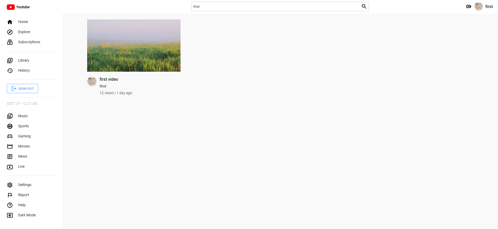

# YouTube Web App

Simple clone from YouTube page.

## Description

Using NodeJS for Backend and ReactJS for Frontend.

## Getting Started

## Demo 
Using Heroku
* [Youtube App](https://youtube-app-full.herokuapp.com/)

## Glance of project 

* Signin


* Home page


* Theme


* Search


* Video


* Upload


* Postman


* MongooseDB


* Firebase


### Dependencies

* Using additional libraries include <i>timeago.js</i>, <i>jsonwebtoken</i>, <i>bcryptjs</i>...
* Developed in <b>Windows 11</b> and <b>Google Chrome Version 103.0.5060.134.</b>

### Installing

They are 2 independent projects
* Move to each folder and run script

### Executing program

* Install dependencies
```
npm install
```

* Run project
```
npm start
```

## Authors

[@ThangNguyen23](https://github.com/ThangNguyen23)

## License

Copyright (c) 2010;

Permission is hereby granted, free of charge, to any person obtaining
a copy of this software and associated documentation files (the
'Software'), to deal in the Software without restriction, including
without limitation the rights to use, copy, modify, merge, publish,
distribute, sublicense, and/or sell copies of the Software, and to
permit persons to whom the Software is furnished to do so, subject to
the following conditions:

The above copyright notice and this permission notice shall be
included in all copies or substantial portions of the Software.

## Acknowledgments

You can need it
* [Firebase](https://github.com/firebase/)
* [Postman Inc.](https://github.com/postmanlabs)
* [Mongoose](https://github.com/Automattic/mongoose)